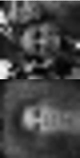
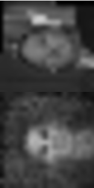

face-detection
==============

Work in progress, face detection project

* Loads the LFW dataset
* Convert face images to 20x20 greyscale matrices
* Train an autoencoder to reproduce faces (reduction to an artificial 25 dimensional space)

Autoencoding result
===================

One backprop pass on the dataset (probably still mostly a global average) :

