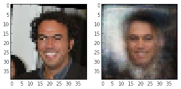
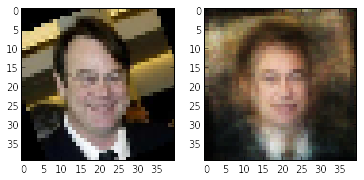
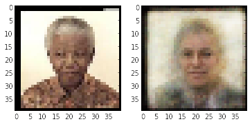
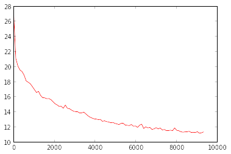

.. code:: python

    %matplotlib inline
    from pylab import *
    import dataset
    import fullyconn
    from IPython import display
Loading data
============

.. code:: python

    data = dataset.load_dataset()
    train_data = data[:-len(data)/2]
    test_data = data[:len(data)/2]

.. parsed-literal::

    Loading dataset.bin

Model plan (fcc autoencoder 1600-30-1600 with MSE loss)
=======================================================

.. code:: python

    def build_nn():
        print("Building NN")
        nn = fullyconn.MLP(1600)
        nn.add_layer("bottleneck", 30)
        nn.add_layer("reconstruction", 1600)
        return nn
Evaluation function (test set)
==============================

.. code:: python

    def test_precision(encode_decode):
        # L1 distance between original example and encoded-decoded example
        precision = np.absolute(test_data - encode_decode(test_data)).sum()
        # Normalization
        precision = precision / 1600 / len(test_data)
        return precision
Reconstruction visualisation
============================

.. code:: python

    import Image
    def show_reconstruction(example, encode_decode):
        reconstructed = encode_decode(np.array([example]))
        
        example = np.array(example.reshape(40, 40) * 255, dtype="uint8")
        reconstructed = np.array(reconstructed.reshape(40, 40), dtype="float32")
        
        figure()
        subplot(121)
        imshow(example, cmap=cm.binary, interpolation="nearest")
        subplot(122)
        imshow(reconstructed, cmap=cm.binary, interpolation="nearest")
Model training
==============

.. code:: python

    def train_network(nn, learning_rate, batch_size, steps):
        epoch = []
        train = nn.build_train(learning_rate)
        eval  = nn.build_eval()
        for step_id in range(steps):
            for batch_id in range(0, len(train_data) / batch_size):
                ts = train_data[batch_id * batch_size: (batch_id + 1) * batch_size]
    
                train(ts, ts)
                
                if batch_id % 100 == 0:
                    precision = test_precision(eval)
                    epoch.append(precision * 100)
                    for i in range(5):
                        show_reconstruction(test_data[i], eval)
                    display.clear_output(wait=True)
                    figure()
                    x = linspace(0, len(epoch) * 100, len(epoch))
                    plot(x, epoch, 'r')
                    show()
.. code:: python

    train_network(build_nn(), 0.005, 10, 100)

